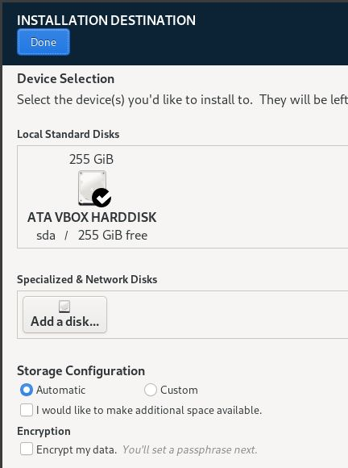

# Installation of and setup Alma Linux for dotNet development.
### ( these screen shots were taken within a VirtualBox VM, but aside from that the commands and setup would apply to a real workstation as well )

- Create a new VM ... I'll provide screen shots of my typical settings pages but you do you.
- 
- 
- 
- 
- 
- 
- 
- Save these additional settings and Start the VM
- 
- 
- On the next screen, we'll be focusing on interacting with 5 pieces of configuration
- 
- 1 => Click "Software Selection" and change "Basic Environment" from "Server with GUI" to "Workstation" and click "Done" in the upper left.
- 
- 2 => Click "Installation Destination" and confirm that, for basic demonstration purposes, that the large disk/partition is selected and click "Done" in the upper left.
- 
- 3 => Click "Network & Host Name" and provide a host name.  Click "Apply" and then click "Done" in the upper left.
- 
- 4 => Click "Root Password" and provide a password.  Click "Done" in the upper left.  Note: if you are providing a weak password, this screen in the Wizard will make you click "Done" twice to confirm that you do in fact want to proceed with a weak password.
- 
- 5 => Click "User Creation" provide a username & password.  Clikc "Done" in the upper left. Note: if you are providing a weak password, this screen in the Wizard will make you click "Done" twice to confirm that you do in fact want to proceed with a weak password.
- 
- You can now click "Begin Installation" ... this will begin the installation.  
- 
- Once the installation is complete, the installer will let you know and now you can reboot the system by clicking "Reboot System"
- 
- Once the system has rebooted, you have logged in, and you may make it to your desktop environment, you may be prompted to take a "tour" ... take the tour and finish ... or just skip the tour.
- Now start a terminal.  This can be done by either hitting the Super Key (ie, the Windows key) or by clicking "Activities" in the upper left.  Eithe way, this will bring you to a place where you can start typing "Terminal" and select the Terminal icon to start the Terminal
- 
- You should now be here:
- 
- The first command will be to refresh our cache of system software sources.
- ``` sudo dnf makecache -–refresh ```
- (since this is the first time you running a ``` sudo ``` command, you will be prompted for your password) ... type your password and let the command finish.  As it runs, you'll see some output as the caches are updated and you'll end up back at your prompted.
- 
- The next command we'll run will apply any available system updates.
- ``` sudo dnf upgrade -–refresh ```
- This command will run in much the same way as the previous but if there are software packages that need updating, the system will be upgrade.  There is a chance that you system may already be update up to date.  Review the output on your screen; if it looks like software updates were applied, now would be a good time to restart.  Otherwise, proceed.
- 
- The next command will be to install a dev-tools package group.
- ``` sudo dnf groupinstall "Development Tools" ```
- This command will first output a listing of all the changes that are about to happen
- 
- Type "y" and hit enter to proceed.  If you get prompted to import an update to the AlmaLinux AppStream GPG key, type "y" to proceed
- 
- Now is a great time again to reboot.  So, restart/reboot your computer/VM and log back in once your restarted.
- If you are infact running this as a Virtual Machine, now is a great time to install the VirtualBox Linux Additions ... these help with things like screen-resizing, mouse movements, and sharing the clip-board.   So, from the parent window of your VM, click the "Devices" pull-down and choose "Insert Guest Additions CD image ..."
- 
- On this version of Alma Linux, it should be configured for Auto-Play if there is an action that can be taken when a virtual disk image is inserted, so you should see a pop-up like this.
- 
- Go ahead and click "Run', type your password and click "Authenticate" ... this will kick off the install off the virtual CD image from Virtual Box.
- 
- Once that completes, this, again, is a perfect time to reboot your VM image before we proceed.  So, reboot, log back in, and get back to the terminal.
- 
- Once rebooted, and back in the terminal, run the following command:
- ``` sudo dnf groupinstall ".NET Development" ```
- You be prompted to confirm that this is infact what you want to do.  So type "y", press Enter, and let that installation run.
- 
- Oddly enough, it doesn't do much of anything... like .Net SDKs were installed ... luckily at the time of this writing, the standard Alma sources support both the 6.0 LTS version of the dotNetCore SDK as well as version 7.0 of the SDK.  So, we're gonna take care of that next.
- Run:
- ``` sudo dnf install dotnet-sdk-6.0.x86_64 ``` 
- You will get prompted with a display of all the changes that are about occur.  Type "y" and proceed.
- 
- So now, you should see the output of the completed installation and the end of that should look something like this:
- 
- Now run:
- ``` sudo dnf install dotnet-sdk-7.0.x86_64 ```
- Like the last install command, you will be prompted with a display of all that changes that are about type occur.  Type "y" and proceed.
- 
- And again, like the last install, you should see an installation summary that looks similar to this
- 
- Now, to test our installations, we can run ``` dotnet --list-sdks ``` and see that our beloved SDKs are in fact installed.
- 
- Next, we should install a terrific editor/IDE for dotnet.  Let's go with VS Code.  The essentials of these next few steps were learned from [this page](https://idroot.us/install-visual-studio-code-almalinux-9/) so be sure to check that out for more details.
- From within the terminal, enter (paste) and run the following 4 commands:
- 1 => ``` printf "[vscode]\nname=packages.microsoft.com\nbaseurl=https://packages.microsoft.com/yumrepos/vscode/\nenabled=1\ngpgcheck=1\nrepo_gpgcheck=1\ngpgkey=https://packages.microsoft.com/keys/microsoft.asc\nmetadata_expire=1h" | sudo tee -a /etc/yum.repos.d/vscode.repo ```
- 2 => ``` sudo rpm --import https://packages.microsoft.com/keys/microsoft.asc ```
- 3 => ``` sudo dnf update ```
- 4 => ``` sudo dnf install code ```
- These commands set up Microsoft as a valid package repository and kick off the installation which should now look like this:
-  
- Even the goal of this article was to install DotNet, we also often need NodeJS.  To accomplish that, we'll use NVM (node version manager) by following the instructions from [this page](https://github.com/nvm-sh/nvm).  
- At the time of this writing, the version of NVM is v0.39.3.
- From within the Terminal, run the following command:
- ``` curl -o- https://raw.githubusercontent.com/nvm-sh/nvm/v0.39.3/install.sh | bash ```
- The output of that command, should look something like:
-  
- Because of the way NVM installs, you will need to "exit" your terminal and re-open Terminal.
- Now we can easily install something like the latest LTS release of NodeJS with this command:
- ``` nvm instal --lts ```
- Which, when complete, will look something like this:
-  
- We can validate this installation by checking the version of Node and NPM:
-  

- That's it for this one.